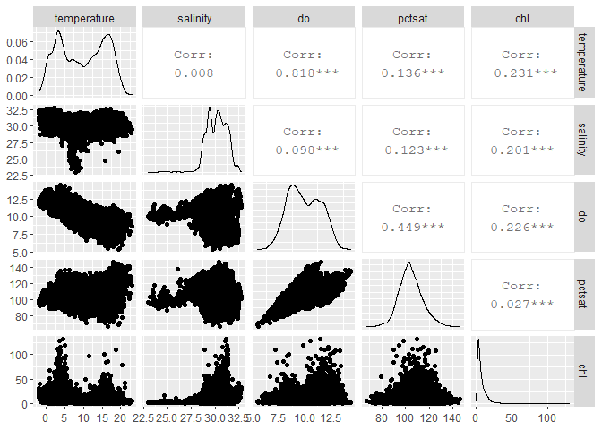
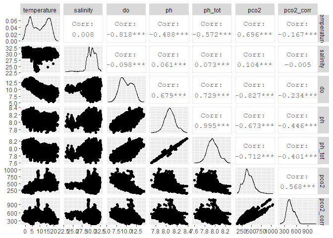
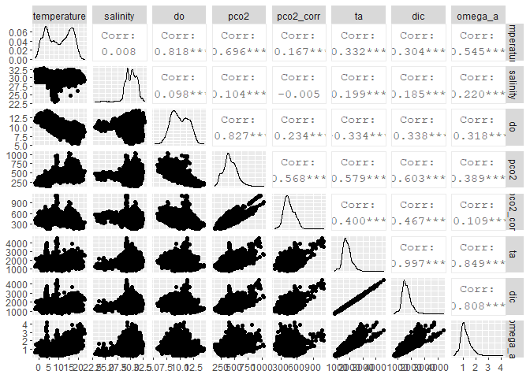
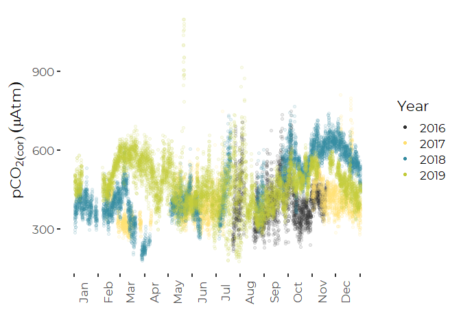
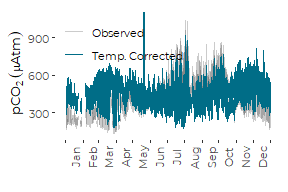
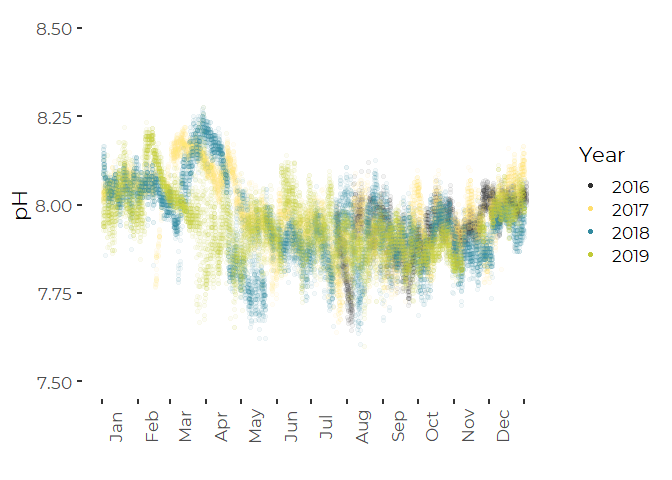
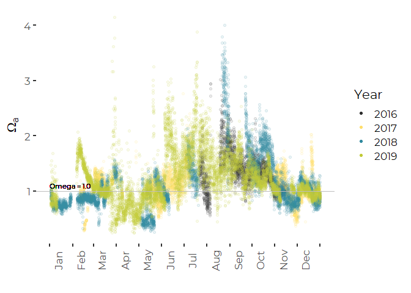
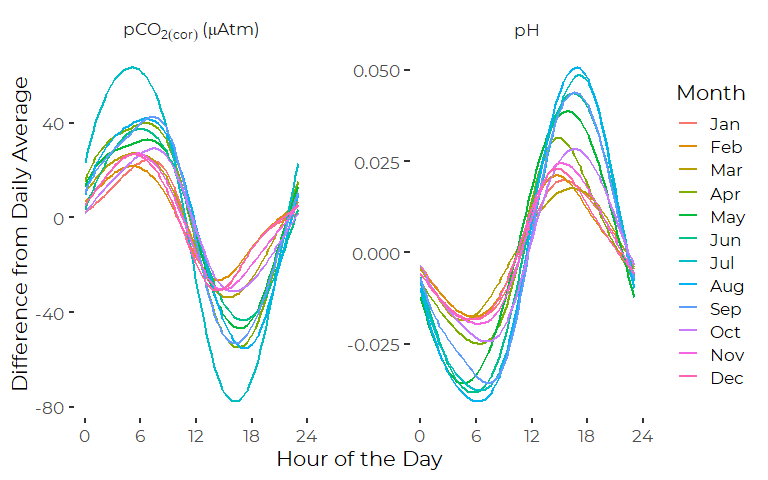
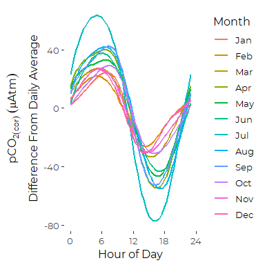
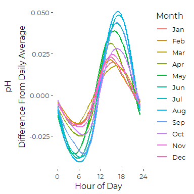

Analysis of OA Data From FOCB
================
Curtis C. Bohlen, Casco Bay Estuary Partnership
7/15/2020

  - [Load Data](#load-data)
      - [Establish Folder Reference](#establish-folder-reference)
      - [Load The Data](#load-the-data)
          - [Primary Data](#primary-data)
          - [CO2SYS Results](#co2sys-results)
          - [Merge pH (Total Scale) data into primary
            data](#merge-ph-total-scale-data-into-primary-data)
      - [Takehashi et al. 2002
        Relationships](#takehashi-et-al.-2002-relationships)
          - [“Expected pCO<sub>2</sub>” at Observed
            Temperature](#expected-pco2-at-observed-temperature)
          - [“Temperature Corrected”
            pCO<sub>2</sub>](#temperature-corrected-pco2)
          - [Calculations](#calculations)
      - [Create Long Form Data](#create-long-form-data)
      - [Create Daily Data Summaries](#create-daily-data-summaries)
      - [Calculate Diurnal Deviations](#calculate-diurnal-deviations)
  - [Exploratory Graphics](#exploratory-graphics)
  - [Summary Statistics](#summary-statistics)
  - [Entire Data Set](#entire-data-set)
      - [Omega Aragonite Observations and Percentage Below Levels of
        Concern](#omega-aragonite-observations-and-percentage-below-levels-of-concern)
      - [Daily Omega Aragonite (medians) Observations and and Percentage
        Below Levels of
        Concern](#daily-omega-aragonite-medians-observations-and-and-percentage-below-levels-of-concern)
      - [Monthly Summary Statistics](#monthly-summary-statistics)
  - [Base Graphics](#base-graphics)
      - [Constants for Axis Labels](#constants-for-axis-labels)
      - [Seasonal Profiles](#seasonal-profiles)
          - [Raw pCO2](#raw-pco2)
          - [Temperature Corrected pCO2](#temperature-corrected-pco2-1)
          - [Both Raw and Corrected pco<sub>2</sub> on One
            Graph.](#both-raw-and-corrected-pco2-on-one-graph.)
          - [pH (Total Scale)](#ph-total-scale)
          - [Aragonite Saturation State](#aragonite-saturation-state)
  - [Daily Patterns](#daily-patterns)
      - [Diurnal Trendlines](#diurnal-trendlines)
      - [Corrected pCO2 Graph](#corrected-pco2-graph)
      - [pH Graph](#ph-graph)


``` r
library(tidyverse)
```

    ## -- Attaching packages ---------------------------------------------------------------------- tidyverse 1.3.0 --

    ## v ggplot2 3.3.2     v purrr   0.3.4
    ## v tibble  3.0.3     v dplyr   1.0.2
    ## v tidyr   1.1.2     v stringr 1.4.0
    ## v readr   1.3.1     v forcats 0.5.0

    ## -- Conflicts ------------------------------------------------------------------------- tidyverse_conflicts() --
    ## x dplyr::filter() masks stats::filter()
    ## x dplyr::lag()    masks stats::lag()

``` r
library(readxl)
library(readr)

library(GGally)
```

    ## Registered S3 method overwritten by 'GGally':
    ##   method from   
    ##   +.gg   ggplot2

``` r
library(zoo)
```

    ## 
    ## Attaching package: 'zoo'

    ## The following objects are masked from 'package:base':
    ## 
    ##     as.Date, as.Date.numeric

``` r
library(lubridate)  # here, for the make_datetime() function
```

    ## 
    ## Attaching package: 'lubridate'

    ## The following objects are masked from 'package:base':
    ## 
    ##     date, intersect, setdiff, union

``` r
library(CBEPgraphics)
load_cbep_fonts()
```

# Load Data

## Establish Folder Reference

``` r
sibfldnm <- 'Original_Data'
parent   <- dirname(getwd())
sibling  <- file.path(parent,sibfldnm)

fn    <- 'CMS1 Data through 2019.xlsx'
fpath <- file.path(sibling,fn)

dir.create(file.path(getwd(), 'figures'), showWarnings = FALSE)
```

## Load The Data

We need to skip the second row here, which is inconvenient largely
because the default “guess” of data contents for each column is based on
the contents of that first row of data.

A solution in an answer to this stack overflow questions
(<https://stackoverflow.com/questions/51673418/how-to-skip-the-second-row-using-readxl>)
suggests reading in the first row only to generate names, then skip the
row of names and the row of units, and read the “REAL” data.

Note that I round the timestamp on the data to the nearest hour.

### Primary Data

``` r
mynames <- read_excel(fpath, sheet = 'Sheet1', n_max = 1, col_names = FALSE)
```

    ## New names:
    ## * `` -> ...1
    ## * `` -> ...2
    ## * `` -> ...3
    ## * `` -> ...4
    ## * `` -> ...5
    ## * ...

``` r
mynames <- unname(unlist(mynames[1,]))  # flatten and simplify
mynames[2] <- 'datetime'               # 
mynames[4] <- 'depth'                   # Address non-standard names
mynames[8] <- 'pctsat'
mynames[18] <- 'omega_a'
mynames <- tolower(mynames)             # convert all to lower case

the_data <- read_excel(fpath, skip=2, col_names = FALSE)
```

    ## New names:
    ## * `` -> ...1
    ## * `` -> ...2
    ## * `` -> ...3
    ## * `` -> ...4
    ## * `` -> ...5
    ## * ...

``` r
names(the_data) <- mynames
rm(mynames)
```

``` r
the_data <- the_data %>%
  select(-count, -time, -datetime)  %>%       # datetime and time contain the same data
  mutate(dt = make_datetime(year, month, day, hour, 0, tz = "America/New_York")) %>%
  rename(datetime = dt) %>%
  mutate(thedate  = as.Date(datetime),
         doy      = as.numeric(format(datetime, format = '%j')),
         tstamp   = paste0(year, '/', sprintf("%02d", month), '/',
                           sprintf("%02d", day), ' ', sprintf("%02d", hour)),
         Month = factor(month, labels = month.abb)) %>%
  arrange(datetime)                # Confirm that data are in chronological order
```

### CO2SYS Results

We ran CO2SYS in Python, principally to calculate estimated pH under the
total pH scale. Her we load it and use a left join by timestamp to add
the data to the principal data set.

``` r
sibfldnm <- 'PyCO2SYS_Calc'
parent   <- dirname(getwd())
sibling  <- file.path(parent,sibfldnm)

fn    <- 'focbco2sys_out.csv'
fpath <- file.path(sibling,fn)


ph_tot_data <- read_csv(fpath, 
    col_types   = cols(month = col_integer(), 
        year    = col_integer(), 
        day     = col_integer(), 
        hour    = col_integer(), 
        temp    = col_number(), 
        sal     = col_number(), 
        pco2    = col_number(), 
        ph      = col_number(), 
        omega_a = col_number(), 
        omega_c = col_number(), 
        ta      = col_number(), 
        dic     = col_number(),
        ph_tot  = col_number())) %>%
  mutate(tstamp = paste0(year, '/', sprintf("%02d", month), '/',
                         sprintf("%02d", day), ' ', sprintf("%02d", hour))) %>%
  select(ph_tot, tstamp)
```

    ## Warning: 56967 parsing failures.
    ## row     col expected actual                                                                                                                                        file
    ##   1 pco2    a number    nan 'C:/Users/curtis.bohlen/Documents/State of the Bay 2020/Data/B13. Ocean and Coastal Acidification/FOCB_OA/PyCO2SYS_Calc/focbco2sys_out.csv'
    ##   1 ph      a number    nan 'C:/Users/curtis.bohlen/Documents/State of the Bay 2020/Data/B13. Ocean and Coastal Acidification/FOCB_OA/PyCO2SYS_Calc/focbco2sys_out.csv'
    ##   1 omega_a a number    nan 'C:/Users/curtis.bohlen/Documents/State of the Bay 2020/Data/B13. Ocean and Coastal Acidification/FOCB_OA/PyCO2SYS_Calc/focbco2sys_out.csv'
    ##   1 omega_c a number    nan 'C:/Users/curtis.bohlen/Documents/State of the Bay 2020/Data/B13. Ocean and Coastal Acidification/FOCB_OA/PyCO2SYS_Calc/focbco2sys_out.csv'
    ##   1 ta      a number    nan 'C:/Users/curtis.bohlen/Documents/State of the Bay 2020/Data/B13. Ocean and Coastal Acidification/FOCB_OA/PyCO2SYS_Calc/focbco2sys_out.csv'
    ## ... ....... ........ ...... ...........................................................................................................................................
    ## See problems(...) for more details.

### Merge pH (Total Scale) data into primary data

Note this assumes there are no duplicate timestamps….

``` r
the_data <- the_data %>%
  left_join(ph_tot_data, by='tstamp') %>%
  select(-tstamp)
rm(ph_tot_data)
```

## Takehashi et al. 2002 Relationships

Here we follow a formula for calculating a “Temperature Corrected”
pCO<sub>2</sub>, which is derived from methods in Takehashi et al. 2002.
The “temperature corrected” version adjusts for the thermodynamic effect
of temperature on pCO<sub>2</sub>.

> Takahashi, Taro & Sutherland, Stewart & Sweeney, Colm & Poisson, Alain
> & Metzl, Nicolas & Tilbrook, Bronte & Bates, Nicholas & Wanninkhof,
> Rik & Feely, Richard & Chris, Sabine & Olafsson, Jon & Nojiri,
> Yukihiro. (2002). Global sea-air CO2 flux based on climatological
> surface ocean pCO2, and seasonal biological and temperature effects.
> Deep Sea Research Part II: Topical Studies in Oceanography. 49.
> 1601-1622. 10.1016/S0967-0645(02)00003-6.

Takahashi et al. 2002 Used direct calculation of “temperature corrected”
pCO<sub>2</sub> as a surrogate for changes in CO<sub>2</sub>
concentration, and conversely, estimates of “expected” thermal
pCO<sub>2</sub>, as estimates of the magnitude of the fluctuations in
pCO<sub>2</sub> one would expect to see due to temperature alone, if
there were no changes in \[CO<sub>2</sub>\].

The Takehashi et al. 2002 equations are as follows:

#### “Expected pCO<sub>2</sub>” at Observed Temperature

\[(pCO_{2} \textrm{ at }T_{obs}) = (pCO_{2})_{obs} \times exp(0.0423(T_{obs}- T_{mean})\]

#### “Temperature Corrected” pCO<sub>2</sub>

\[(pCO_{2} \textrm{ at }T_{mean}) = (pCO_{2})_{obs} \times exp(0.0423(T_{mean}- T_{obs})\]

### Calculations

Here we calculate the “temperature corrected” time series as calculated
in Takehashi et al. “Temperature Corrected” pCO<sub>2</sub> value
(“co2\_corr”) provides a trace of changes in pCO<sub>2</sub> that
“would have happened” in the absence of temperature changes. These
reflect changes in the concentration of CO<sub>2</sub>, which reflect a
combination of biology and diffusion of CO<sub>2</sub> between ocean and
atmosphere and advection past the sensor by tides and currents. Here we
adjust pCO<sub>2</sub> to a “standard temperature” of 12 degrees C. This
is slightly warmer than the observed annual average temperature We use 2
degrees C only for consistency with analysis of the CBEP / UNH data.

``` r
t_ref = 12
the_data <- the_data %>%
  mutate(pco2_corr =  pco2*exp(0.0423*(t_ref-temperature))) %>%
  select(c(16, 17, 11, 10, 9, 19, 12,  18, 1:5, 7,  6, 20, 8, 21, 13:15))  # reorder for convenience
rm(t_ref)
```

## Create Long Form Data

``` r
long_data <- the_data %>%
  pivot_longer(cols= depth:omega_a, names_to='Parameter', values_to = 'Value') %>%
  mutate(Parameter = factor(Parameter,
                            levels = c('depth',
                                       'temperature',
                                       'salinity',
                                       'do',
                                       'pctsat',
                                       'chl',
                                       'ph',
                                       'ph_tot',
                                       'pco2',
                                       'pco2_corr',
                                       'ta',
                                       'dic',
                                       'omega-a')))
```

## Create Daily Data Summaries

``` r
daily_data <- the_data %>%
  select(-hour, -year, -month, -day, -doy) %>%         # Will recalculate these 
  group_by(thedate) %>%
  summarise_at(c("temperature", "salinity", "do", "pctsat", "chl", "ph", "ph_tot",
                 "pco2", "pco2_corr", "ta", "dic", 'omega_a'),
               c(a    = function(x) mean(x, na.rm=TRUE),
                 m    = function(x) median(x, na.rm=TRUE),
                 r    = function(x) {suppressWarnings(max(x, na.rm=TRUE) -
                                                        min(x, na.rm=TRUE))},
                iqr  = function(x) IQR(x, na.rm=TRUE),
                p80r = function(x) {as.numeric(quantile(x, 0.90, na.rm=TRUE) -
                       quantile(x, 0.10, na.rm=TRUE))})) %>%
  mutate(year = as.numeric(format(thedate, format = '%Y')),
         month  = as.numeric(format(thedate, format = '%m')),
         dd   = as.numeric(format(thedate, format = '%d')),
         doy  = as.numeric(format(thedate, format = '%j')),
         Month = factor(month, levels=1:12, labels = month.abb)
         )
```

## Calculate Diurnal Deviations

We calculate hourly deviation from daily averages for the principal OA
measures. This allows us to look at diurnal patterns.

``` r
diurnal_data <- the_data %>%
  group_by(thedate) %>%
  
  # Calculate sample sizes for each day.
  mutate(pco2_n      = sum(! is.na(pco2)),
         pco2_corr_n = sum(! is.na(pco2_corr)),
         ph_n        = sum(! is.na(ph)),
         ph_tot_n    = sum(! is.na(ph_tot)),
         omega_n     = sum(! is.na(omega_a))) %>%
  
  # Calculate centered but not scaled values, day by day.
  mutate(pco2_res      = scale(pco2, scale = FALSE),
         pco2_corr_res = scale(pco2_corr, scale = FALSE),
         ph_res        = scale(ph, scale = FALSE),
         ph_tot_res    = scale(ph_tot, scale = FALSE),
         omega_res     = scale(omega_a, scale=FALSE)) %>%
  ungroup() %>%
  
  # Replace data from any days with less than 20 hours of data with NA
  mutate(pco2_res      = ifelse(pco2_n>=20, pco2_res, NA),
         pco2_corr_res = ifelse(pco2_corr_n>=20, pco2_corr_res, NA),
         ph_res        = ifelse(ph_n>=20, ph_res, NA),
         ph_tot_res    = ifelse(ph_tot_n>=20, ph_res, NA),
         omega_res     = ifelse(omega_n>=20, ph_res, NA)) %>%
  
  # Delete the daily sample size variables
  select(-contains("_n")) %>%
  mutate(Month = factor(month, levels = 1:12, labels=month.abb))
```

# Exploratory Graphics

``` r
the_data %>% ggpairs(c(10:12, 13:14), progress=FALSE)
```

<!-- -->
What jumps out most strongly is the negative association between
temperature and DO. Most of the negative association between DO and
temperature vanishes when looking at percent saturation.  
Temperature show strong bimodal distribution, presumably because of
winter and summer temperature regimes. DO shows weak bimodal structure,
but percent saturation does not.

``` r
the_data %>% ggpairs(c(10:12, 15:18), progress=FALSE)
```

<!-- -->
Mutual temperature dependence of DO and pCO<sub>2</sub> means those two
variables are negatively correlated. WEAK negative association remains
even after temperature correction, so this is not just a thermodynamic
relationship. (Don’t trust statistical significance as observations have
very high autocorrelation.)

Negative pH PCO2 relationships are fairly robust here. They are stronger
before temperature correction.

There are a few wonky observations. They look like high pCO2, moderate
low salinity in moderately cool temperatures. I bet they are all a big
storm event…..

``` r
the_data %>% ggpairs(c(10:12, 17:21), progress=FALSE)
```

<!-- -->
Calculates total alkalinity and dissolved inorganic carbon are nearly
measuring the same thing – no surprise in sea water.

Don’t believe the measures of statistical significance here, as the
implied models do not account for very high autocorrelations. Checking
these correlations will involve developing GAMM models.

# Summary Statistics

# Entire Data Set

This is legacy code. It would be easier today to develop this directly
in the tidyverse.

``` r
the.mins     <- sapply(the_data[9:21], min, na.rm=TRUE)
the.medians  <- sapply(the_data[9:21], median, na.rm=TRUE)
the.means    <- sapply(the_data[9:21], mean, na.rm=TRUE)
the.maxes    <- sapply(the_data[9:21], max, na.rm=TRUE)
the.SDs  <-   sapply(the_data[9:21], sd, na.rm=TRUE)
the.samplesizes <-  sapply(the_data[9:21], function(x) sum(! is.na(x)) )
result   <-  cbind(the.mins, the.medians, the.means, the.maxes, the.SDs, the.samplesizes)
colnames(result) <- c('Minimum', 'Median', 'Mean', 'Maximum', 'Std. Deviation', 'Observations')
rownames(result) <- c('Depth',
                      'Temperature',
                      'Salinity',
                      'DO (mg/l)',
                      'Percent Saturation',
                      'Chlorophyll-a',
                      'pH (NMS)',
                      'pH (Total, calculated)',
                      'pCO2',
                      'pCO2_corr',
                      'Total Alkalinity',
                      'Dissolved Inorganic Carbon',
                      'Omega Aragonite'
                      )
knitr::kable(result, digits = c(1,1,2,1,3,0))
```

|                            | Minimum | Median |    Mean | Maximum | Std. Deviation | Observations |
| :------------------------- | ------: | -----: | ------: | ------: | -------------: | -----------: |
| Depth                      |     0.1 |    2.7 |    2.70 |     5.1 |          1.061 |        29675 |
| Temperature                |   \-2.0 |   10.0 |    9.80 |    23.0 |          6.161 |        29926 |
| Salinity                   |    23.0 |   30.2 |   30.17 |    32.8 |          1.073 |        29452 |
| DO (mg/l)                  |     5.4 |    9.8 |    9.94 |    14.4 |          1.549 |        29353 |
| Percent Saturation         |    67.2 |  103.8 |  104.50 |   146.2 |          9.636 |        29353 |
| Chlorophyll-a              |   \-0.2 |    5.2 |    7.49 |   130.8 |          7.655 |        29584 |
| pH (NMS)                   |     7.7 |    8.1 |    8.07 |     8.4 |          0.094 |        29358 |
| pH (Total, calculated)     |     7.6 |    7.9 |    7.95 |     8.3 |          0.100 |        29356 |
| pCO2                       |   132.3 |  406.3 |  416.66 |  1037.8 |        121.262 |        19466 |
| pCO2\_corr                 |   176.5 |  436.3 |  449.91 |  1097.8 |         96.384 |        19466 |
| Total Alkalinity           |   779.2 | 1724.4 | 1761.59 |  4598.1 |        338.146 |        19466 |
| Dissolved Inorganic Carbon |   756.2 | 1622.7 | 1657.09 |  4382.7 |        314.167 |        19466 |
| Omega Aragonite            |     0.2 |    1.1 |    1.19 |     4.1 |          0.424 |        19465 |

``` r
write.csv(result, 'summarystats_OA_FOCB.csv')
```

## Omega Aragonite Observations and Percentage Below Levels of Concern

``` r
below1.5 <- sum(the_data$omega_a<1.5, na.rm=TRUE)
below1.0 <- sum(the_data$omega_a<1.0, na.rm=TRUE)
TotObs   <- sum(! is.na(the_data$omega_a))
pctbelow1.5 <- below1.5/TotObs
pctbelow1.0 <- below1.0/TotObs

res <- unlist( list(`Count Below 1.0` = below1.0, `Count Below 1.5` = below1.5,
      `Observations` = TotObs,
      `Percent Below 1.0` = pctbelow1.0,
      `Percent Below 1.5` =pctbelow1.5))
rm(below1.0, below1.5, TotObs, pctbelow1.0, pctbelow1.5)
knitr::kable(t(res), digits = c(0,0,0,3,3))
```

| Count Below 1.0 | Count Below 1.5 | Observations | Percent Below 1.0 | Percent Below 1.5 |
| --------------: | --------------: | -----------: | ----------------: | ----------------: |
|            7108 |           15800 |        19465 |             0.365 |             0.812 |

## Daily Omega Aragonite (medians) Observations and and Percentage Below Levels of Concern

``` r
below1.5 <- sum(daily_data$omega_a_m<1.5, na.rm=TRUE)
below1.0 <- sum(daily_data$omega_a_m<1.0, na.rm=TRUE)
TotObs   <- sum(! is.na(daily_data$omega_a_m))
pctbelow1.5 <- below1.5/TotObs
pctbelow1.0 <- below1.0/TotObs

res <- unlist(list(`Count Below 1.0` = below1.0, `Count Below 1.5` = below1.5,
      `Observations` = TotObs,
      `Percent Below 1.0` = pctbelow1.0,
      `Percent Below 1.5` =pctbelow1.5))
rm(below1.0, below1.5, TotObs, pctbelow1.0, pctbelow1.5)
knitr::kable(t(res), digits = c(0,0,0,3,3))
```

| Count Below 1.0 | Count Below 1.5 | Observations | Percent Below 1.0 | Percent Below 1.5 |
| --------------: | --------------: | -----------: | ----------------: | ----------------: |
|             305 |             687 |          839 |             0.364 |             0.819 |

## Monthly Summary Statistics

This is means **across** years. This is NOT the same as an estimated
monthly average, adjusted for year to year variation, imbalances in time
of day data was collected, etc. For that, we would need to estimate
marginal means from a GAMM. We do not pursue that idea in this notebook.

``` r
monthly_tbl <- the_data %>%
  select(datetime, year, Month, temperature, salinity, do, pctsat, chl, ph, ph_tot, pco2, pco2_corr, omega_a) %>%

  pivot_longer(temperature:omega_a, names_to = 'parameter',
               values_to = 'value') %>%
  group_by(Month, parameter) %>%
  summarise(
    avg    = round(mean(value, na.rm = TRUE), 2),
    median = round(median(value, na.rm = TRUE), 2),
    sd     = round(sd(value, na.rm = TRUE), 3),
    count  = sum(!is.na(value))
  ) %>%
  pivot_longer(cols = c('avg', 'median', 'sd', 'count'),
               names_to = 'label') %>%
  pivot_wider(id_cols = c(parameter, label), names_from=Month) 
```

    ## `summarise()` regrouping output by 'Month' (override with `.groups` argument)

``` r
knitr::kable(monthly_tbl)
```

| parameter   | label  |      Jan |      Feb |      Mar |      Apr |      May |      Jun |      Jul |      Aug |      Sep |      Oct |      Nov |      Dec |
| :---------- | :----- | -------: | -------: | -------: | -------: | -------: | -------: | -------: | -------: | -------: | -------: | -------: | -------: |
| chl         | avg    |   11.720 |    7.240 |   12.450 |    8.650 |    3.380 |    3.790 |    5.270 |    6.870 |    7.830 |    7.120 |    5.750 |    9.630 |
| chl         | median |   12.410 |    5.900 |    7.930 |    4.260 |    2.540 |    3.310 |    4.420 |    5.650 |    5.580 |    6.060 |    4.330 |    6.930 |
| chl         | sd     |    6.001 |    5.696 |   14.761 |   10.516 |    3.009 |    2.643 |    3.888 |    5.322 |    7.118 |    4.101 |    4.654 |    9.473 |
| chl         | count  | 2231.000 | 2016.000 | 2221.000 | 2159.000 | 2166.000 | 2175.000 | 2503.000 | 2942.000 | 2802.000 | 2975.000 | 2430.000 | 2964.000 |
| do          | avg    |   11.850 |   12.070 |   11.780 |   11.360 |   10.470 |    9.430 |    8.970 |    8.700 |    8.210 |    8.330 |    9.280 |   10.690 |
| do          | median |   11.790 |   12.110 |   11.830 |   11.340 |   10.500 |    9.450 |    8.980 |    8.730 |    8.190 |    8.350 |    9.300 |   10.660 |
| do          | sd     |    0.637 |    0.678 |    0.634 |    0.697 |    0.654 |    0.737 |    0.780 |    0.871 |    0.836 |    0.624 |    0.603 |    0.726 |
| do          | count  | 2231.000 | 1803.000 | 2214.000 | 2160.000 | 2070.000 | 2175.000 | 2504.000 | 2947.000 | 2879.000 | 2975.000 | 2431.000 | 2964.000 |
| omega\_a    | avg    |    0.800 |    1.080 |    1.070 |    0.780 |    0.900 |    1.310 |    1.560 |    1.680 |    1.470 |    1.380 |    0.980 |    1.010 |
| omega\_a    | median |    0.770 |    0.950 |    1.050 |    0.730 |    0.930 |    1.200 |    1.530 |    1.580 |    1.430 |    1.330 |    0.980 |    1.000 |
| omega\_a    | sd     |    0.125 |    0.329 |    0.301 |    0.273 |    0.311 |    0.432 |    0.418 |    0.571 |    0.307 |    0.281 |    0.210 |    0.175 |
| omega\_a    | count  |  835.000 | 1349.000 | 1734.000 |  784.000 | 1878.000 | 1662.000 | 1607.000 | 1383.000 | 1671.000 | 2240.000 | 2103.000 | 2219.000 |
| pco2        | avg    |  259.060 |  280.980 |  295.270 |  367.300 |  388.870 |  419.360 |  526.920 |  510.860 |  536.110 |  504.170 |  443.220 |  350.200 |
| pco2        | median |  243.690 |  276.880 |  318.740 |  377.970 |  379.810 |  415.780 |  519.830 |  489.220 |  526.720 |  503.480 |  455.770 |  343.900 |
| pco2        | sd     |   48.090 |   40.591 |   86.212 |   66.990 |   65.465 |   55.816 |  114.771 |   99.523 |   80.479 |  101.772 |   80.404 |   71.731 |
| pco2        | count  |  835.000 | 1349.000 | 1734.000 |  784.000 | 1878.000 | 1662.000 | 1607.000 | 1383.000 | 1672.000 | 2240.000 | 2103.000 | 2219.000 |
| pco2\_corr  | avg    |  413.320 |  441.520 |  439.510 |  479.700 |  422.720 |  400.040 |  427.700 |  394.840 |  443.270 |  480.930 |  514.510 |  489.590 |
| pco2\_corr  | median |  409.790 |  434.300 |  454.310 |  493.130 |  408.930 |  396.680 |  419.010 |  376.890 |  435.250 |  492.350 |  509.640 |  474.450 |
| pco2\_corr  | sd     |   52.307 |   71.437 |  130.699 |   84.089 |   80.283 |   60.500 |   98.633 |   85.687 |   72.546 |   90.863 |   97.276 |   90.844 |
| pco2\_corr  | count  |  835.000 | 1349.000 | 1734.000 |  784.000 | 1878.000 | 1662.000 | 1607.000 | 1383.000 | 1672.000 | 2240.000 | 2103.000 | 2219.000 |
| pctsat      | avg    |  103.410 |  105.610 |  106.390 |  109.720 |  110.570 |  108.040 |  111.680 |  110.120 |  100.850 |   96.000 |   95.940 |  100.030 |
| pctsat      | median |  102.900 |  104.800 |  105.060 |  109.500 |  110.300 |  107.900 |  111.400 |  110.580 |  100.900 |   95.500 |   95.600 |   99.800 |
| pctsat      | sd     |    4.308 |    5.503 |    6.363 |    7.572 |    6.448 |    8.713 |   10.924 |   11.342 |   10.235 |    7.321 |    4.951 |    5.155 |
| pctsat      | count  | 2231.000 | 1803.000 | 2214.000 | 2160.000 | 2070.000 | 2175.000 | 2504.000 | 2947.000 | 2879.000 | 2975.000 | 2431.000 | 2964.000 |
| ph          | avg    |    8.130 |    8.150 |    8.180 |    8.110 |    8.020 |    8.040 |    8.020 |    8.030 |    8.010 |    8.030 |    8.020 |    8.100 |
| ph          | median |    8.140 |    8.150 |    8.210 |    8.140 |    8.040 |    8.040 |    8.030 |    8.040 |    8.010 |    8.030 |    8.020 |    8.100 |
| ph          | sd     |    0.048 |    0.064 |    0.107 |    0.127 |    0.083 |    0.070 |    0.076 |    0.080 |    0.061 |    0.060 |    0.062 |    0.050 |
| ph          | count  | 2231.000 | 1803.000 | 2211.000 | 2160.000 | 2166.000 | 2176.000 | 2503.000 | 2859.000 | 2879.000 | 2975.000 | 2431.000 | 2964.000 |
| ph\_tot     | avg    |    8.040 |    8.060 |    8.080 |    8.000 |    7.900 |    7.920 |    7.890 |    7.910 |    7.890 |    7.910 |    7.910 |    7.990 |
| ph\_tot     | median |    8.040 |    8.050 |    8.110 |    8.030 |    7.930 |    7.920 |    7.900 |    7.910 |    7.890 |    7.910 |    7.910 |    8.000 |
| ph\_tot     | sd     |    0.048 |    0.064 |    0.107 |    0.128 |    0.083 |    0.070 |    0.075 |    0.079 |    0.060 |    0.060 |    0.063 |    0.051 |
| ph\_tot     | count  | 2231.000 | 1803.000 | 2210.000 | 2160.000 | 2166.000 | 2176.000 | 2503.000 | 2859.000 | 2878.000 | 2975.000 | 2431.000 | 2964.000 |
| salinity    | avg    |   30.590 |   30.620 |   30.280 |   29.140 |   29.030 |   29.300 |   30.230 |   30.470 |   30.570 |   30.700 |   30.250 |   30.420 |
| salinity    | median |   30.510 |   30.700 |   30.300 |   29.430 |   29.220 |   29.240 |   30.230 |   30.690 |   31.030 |   31.030 |   30.090 |   30.510 |
| salinity    | sd     |    1.087 |    0.744 |    0.593 |    1.474 |    0.820 |    0.665 |    0.795 |    0.773 |    1.033 |    0.997 |    0.860 |    0.817 |
| salinity    | count  | 2231.000 | 1803.000 | 2214.000 | 2160.000 | 2166.000 | 2176.000 | 2504.000 | 2949.000 | 2879.000 | 2975.000 | 2431.000 | 2964.000 |
| temperature | avg    |    1.380 |    1.330 |    2.600 |    5.830 |    9.840 |   13.420 |   17.100 |   17.940 |   16.550 |   13.340 |    8.170 |    4.080 |
| temperature | median |    1.300 |    1.100 |    2.740 |    5.560 |    9.830 |   13.370 |   17.030 |   17.910 |   16.450 |   13.550 |    7.960 |    3.940 |
| temperature | sd     |    1.466 |    1.236 |    1.183 |    1.499 |    1.504 |    1.543 |    1.560 |    1.350 |    1.297 |    1.552 |    2.078 |    1.553 |
| temperature | count  | 2231.000 | 1803.000 | 2214.000 | 2160.000 | 2166.000 | 2176.000 | 2504.000 | 2949.000 | 2879.000 | 2975.000 | 2894.000 | 2975.000 |

``` r
write_csv(monthly_tbl, 'Monthly_summaries_OA_FOCB.csv')
```

# Base Graphics

## Constants for Axis Labels

``` r
monthlengths <-  c(31,28,31, 30,31,30,31,31,30,31,30,31)
cutpoints    <- c(0, cumsum(monthlengths)[1:12])
monthlabs    <- c(month.abb,'')
```

## Seasonal Profiles

These graphs combine data from multiple years to generate a picture of
seasonal conditions across multiple years. Since data coverage is
inconsistent year to year, data for some times of year are derived from
just one or two years, which could bias the results.

### Raw pCO2

``` r
plt <- ggplot(the_data, aes(doy, pco2)) + geom_point(aes(color = factor(year)), alpha = 0.1) +
  
  geom_hline(aes(yintercept = 400), lty = 'solid', color = 'gray') +
  annotate('text', x=0, y=430, label= expression(pCO[2*(cor)]~'='~ 400), hjust = 0, size=3) +
  
  xlab('') +
  ylab(expression (pCO[2]~(mu*Atm))) +
  scale_color_manual(values=cbep_colors()[c(3,2,5,4)], name='Year') +
  scale_x_continuous(breaks = cutpoints, labels = monthlabs) +
  guides(colour = guide_legend(override.aes = list(alpha = 1))) +
  theme_cbep() +
  theme(axis.text.x=element_text(angle=90, vjust = 1.5))
plt
```

    ## Warning: Removed 10799 rows containing missing values (geom_point).

    ## Warning in is.na(x): is.na() applied to non-(list or vector) of type
    ## 'expression'

<!-- -->

``` r
#ggsave('figures/pco2RawSeasonal_focb.png', type = 'cairo', width = 7, height = 5)
ggsave('figures/pco2RawSeasonal_focb.pdf', device=cairo_pdf, width = 7, height = 5)
```

    ## Warning: Removed 10799 rows containing missing values (geom_point).
    
    ## Warning: is.na() applied to non-(list or vector) of type 'expression'

### Temperature Corrected pCO2

It’s not technically OK to show a reference line on a figure with
temperature-corrected pCO2. The equilibrium between \[co<sub>2</sub>\]
and fugacity is temperature dependent.

``` r
plt <- ggplot(the_data, aes(doy, pco2_corr)) + geom_point(aes(color = factor(year)), alpha = 0.1) +
  
  # geom_hline(aes(yintercept = 400), lty = 'dotted', color = 'gray') +
  # annotate('text', x=365, y=370, label= expression(pCO[2*(cor)]~'='~ 400), hjust=1, size=3) +
  
  xlab('') +
  ylab(expression (pCO[2*(cor)]~(mu*Atm))) +
  scale_color_manual(values=cbep_colors()[c(3,2,5,4)], name='Year') +
  scale_x_continuous(breaks = cutpoints, labels = monthlabs) +
  guides(colour = guide_legend(override.aes = list(alpha = 1))) +
  theme_cbep() +
  theme(axis.text.x=element_text(angle=90, vjust = 1.5))
plt
```

    ## Warning: Removed 10799 rows containing missing values (geom_point).

<!-- -->

``` r
#ggsave('figures/pco2Seasonal_focb.png', type = 'cairo', width = 7, height = 5)
ggsave('figures/pco2Seasonal_focb.pdf', device=cairo_pdf, width = 7, height = 5)
```

    ## Warning: Removed 10799 rows containing missing values (geom_point).

This shows much less obvious seasonality than the CBEP / UNH site.

### Both Raw and Corrected pco<sub>2</sub> on One Graph.

``` r
plt  <- long_data %>% filter(Parameter %in% c('pco2', 'pco2_corr')) %>%
  
  mutate(Parameter = factor(Parameter, levels = c('pco2', 'pco2_corr'),
                            labels = c('Observed',
                                       'Temp. Corrected'))) %>% 
  
  ggplot(aes(x=doy, y=Value, alpha=Parameter)) + geom_line(aes(color = Parameter)) +
 
  scale_alpha_discrete(range = c(0.25, 1), name = '') +
  scale_x_continuous(breaks = cutpoints, labels = monthlabs) + 
  scale_color_manual(values=cbep_colors2(), name='') +

  xlab('') +
  ylab(expression (pCO[2]~(mu*Atm))) +

  #guides(colour = guide_legend(override.aes = list(alpha = c(0.25, 1)))) +
  
  theme_cbep(base_size = 10) +
  theme(axis.text.x=element_text(angle=90, vjust = 1.5)) +
  theme(legend.position= c(.3, .8))
```

    ## Warning: Using alpha for a discrete variable is not advised.

``` r
plt
```

    ## Warning: Removed 96 row(s) containing missing values (geom_path).

<!-- -->

``` r
#ggsave('figures/pco2compare_focb.png', type = 'cairo', width = 3, height = 2)
ggsave('figures/pco2compare_focb.pdf', device=cairo_pdf, width = 3, height = 2)
```

    ## Warning: Removed 96 row(s) containing missing values (geom_path).

### pH (Total Scale)

``` r
plt <- ggplot(the_data, aes(doy, ph_tot)) + geom_point(aes(color = factor(year)),alpha = 0.05) +
  xlab('') +
  ylab('pH') +
  scale_color_manual(values=cbep_colors()[c(3,2,5,4)], name='Year') +
  scale_x_continuous(breaks = cutpoints, labels = monthlabs) +

  scale_y_continuous(limits = c(7.5, 8.5), breaks = c(7.5, 7.75, 8.0, 8.25, 8.5)) +
  
  guides(colour = guide_legend(override.aes = list(alpha = 1))) +
  theme_cbep() +
  theme(axis.text.x=element_text(angle=90, vjust = 1.5))
plt
```

    ## Warning: Removed 909 rows containing missing values (geom_point).

<!-- -->

``` r
#ggsave('figures/phSeasonal_focb.png', type = 'cairo', width = 7, height = 5)
ggsave('figures/phSeasonal_focb.pdf', device=cairo_pdf, width = 7, height = 5)
```

    ## Warning: Removed 909 rows containing missing values (geom_point).

### Aragonite Saturation State

``` r
plt <- ggplot(the_data, aes(doy, omega_a)) + geom_point(aes(color = factor(year)), alpha = 0.1) +
  
  # geom_hline(aes(yintercept = 1.5), lty = 'solid', color = 'gray') +
  # geom_text(aes(x=0, y=1.4, label= 'Omega = 1.5', hjust = 0), size=3) +
  
  geom_hline(aes(yintercept = 1), lty = 'solid', color = 'gray') +
  geom_text(aes(x=0, y=1.1, label= 'Omega = 1.0', hjust = 0), size=3) +
  
  
  xlab('') +
  ylab(expression(Omega[a])) +
  
  scale_color_manual(values=cbep_colors()[c(3,2,5,4)], name='Year') +
  scale_x_continuous(breaks = cutpoints, labels = monthlabs) +
  
  guides(colour = guide_legend(override.aes = list(alpha = 1))) +
  
  theme_cbep() +
  theme(axis.text.x=element_text(angle=90, vjust = 1.5))
  
plt
```

    ## Warning: Removed 10800 rows containing missing values (geom_point).

<!-- -->

``` r
#ggsave('figures/omegaSeasonal_focb.png', type = 'cairo', width = 7, height = 5)
ggsave('figures/omegaSeasonal_focb.pdf', device=cairo_pdf, width = 7, height = 5)
```

    ## Warning: Removed 10800 rows containing missing values (geom_point).

# Daily Patterns

``` r
long_diurnal_data <- diurnal_data %>% select(-c(9:16)) %>%  # Drop all raw observations; retain diurnal residuals
                                               
  pivot_longer(contains("_res"), names_to='metric') %>%
  mutate(metric= sub("_res", "", metric))       #simplify names
```

## Diurnal Trendlines

Here we display trendlines derived from GAM models by month. As noted
above, these models are likely to slightly overfit the trends.

Notice that the selection of the dimension of the periodic basis of the
smooths in the GAM (signaled in k=6) is essentially selected here by eye
to create a visual balance between simplicity and complexity. The
default here probably over-fits, as described above. We explore the
implied GAM (and related GAMM) further in the another R Notebook in the
“Analysis” folder.

``` r
labs <- c(expression(paste(pCO[2*(cor)], ' (', mu, 'Atm)')), 'pH')
names(labs) <- unique(long_diurnal_data$metric)[c(2,4)]

tmp <- long_diurnal_data %>%
  filter( metric %in% c('pco2_corr', 'ph_tot')) %>%
  mutate(metric = factor(metric, levels = names(labs), labels = labs))

plt <-
  ggplot(tmp, aes(hour,value, color = Month)) +
  geom_smooth(aes(color = Month), method = "gam",
              formula = y~s(x, bs='cc', k=6), se=FALSE) +

  theme_cbep() +
  theme(panel.spacing = unit(2, "lines")) +
  
  xlab('Hour of the Day') +
  ylab('Difference from Daily Average') +
  facet_wrap(~metric, nrow=1, scales='free_y',
                   labeller = label_parsed ) +
  scale_color_discrete(name = "Month") + 
  scale_x_continuous(breaks = c(0,6,12,18,24)) #+
  #ggtitle('Daily Fluctuations')
plt
```

    ## Warning: Removed 12388 rows containing non-finite values (stat_smooth).

<!-- -->

``` r
ggsave('figures/dailyco2andphbymonth_focb.pdf', device = cairo_pdf, width = 8, height = 5)
```

    ## Warning: Removed 12388 rows containing non-finite values (stat_smooth).

``` r
#ggsave('figures/dailyco2andphbymonth_focb.png', type = 'cairo', width = 8, height = 5)
```

## Corrected pCO2 Graph

``` r
plt <- diurnal_data %>%
  ggplot(aes(hour,pco2_corr_res)) +
  geom_smooth(aes(color=Month), method = "gam",
              formula = y~s(x, bs='cc', k=6), se=FALSE, lwd=0.75) +
  # annotate(geom = "text", label = expression(atop("Temperature", "Corrected"~pCO[2])),
  #          x = 24, y = 30,
  #          color = "black", hjust=1, size = 4) +
  theme_cbep(base_size = 12) +
  xlab('Hour of Day') +
  ylab(expression (atop(pCO[2*(cor)]~(mu*Atm), Difference~From~Daily~Average))) +
  scale_color_discrete(name = "Month") + 
  theme(legend.key.width = unit(0.25,"in"),
        legend.text      = element_text(size = 10)
        ) +
  scale_x_continuous(breaks = c(0,6,12,18,24)) #+
  #ggtitle(expression(Daily~pCO[2]))
plt
```

<!-- -->

``` r
ggsave('figures/dailyCO2bymonth_focb.pdf', device=cairo_pdf, width = 4, height = 4)
#ggsave('figures/dailyCO2bymonth_focb.png', type='cairo', width = 4, height = 4)
```

## pH Graph

``` r
plt <- diurnal_data %>%
  ggplot(aes(hour,ph_res)) +
  geom_smooth(aes(color=Month), method = "gam",
              formula = y~s(x, bs='cc', k=6), se=FALSE) +
  theme_cbep(base_size = 12) +
  theme(legend.key.width = unit(0.25,"in"),
        legend.text      = element_text(size = 10)
        ) +
  xlab('Hour of Day') +
  ylab(expression (atop(pH, Difference~From~Daily~Average))) +
  scale_color_discrete(name = "Month") + 
  scale_linetype_discrete(name = "Month") + 
  theme(legend.key.width=unit(0.25,"in")) +
  scale_x_continuous(breaks = c(0,6,12,18,24)) #+
  #ggtitle(expression(Daily~pH))
plt
```

<!-- -->

``` r
ggsave('figures/dailyphbymonth_focb.pdf', device=cairo_pdf, width = 4, height = 4)
#ggsave('figures/dailyphbymonth_focb.png', type='cairo', width = 4, height = 4)
```
